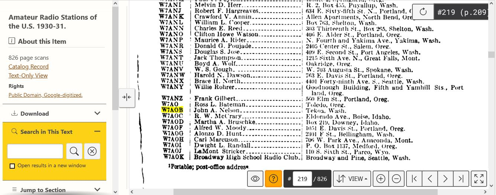

_Maybe you're looking for [last week's newsletter](/weekly/2023-03-05)_?

## Recap 🔁

* 03/08 Wed NOT LCARA Presentation Night
  * Although no topic was scheduled for presentation, some members did come up to the clubhouse
    only to discover as much in person. My sincere _apologies_ for lack of clarity with regard to
    presentation night.
  * Note that **I will email, announce on net, and post to facebook when
    presentation night will occur**.
  * Only the ACS Meeting (first Wednesday) and LCARA meeting (third Wednesday) are
    regularly scheduled.
  * Presentation night (second Wednesday) and Technical Committee (fourth Wednesday)
    meetings will occur as topics are available and will be announced at least one week
    prior to the event.

## Upcoming Events 🗓

* 3/15 Wed 19:00 **LCARA Business Meeting** at LCARA Clubhouse [+ ZOOM]
  * [Last meeting minutes](https://w7dg-lcara.github.io/static/minutes/2023/business/2023_02_15_LCARA_Business_Meeting_latest.pdf) [PDF]
* 3/18 Sat 13:00 **Third Saturday Operating/Training**: Learn how to operate the LCARA club station

### Later in March

* 3/25 Sat [CQ WPX Contest SSB](https://www.cqwpx.com/)

### WSDOT Communication Exercise

Next **5th Saturday exercise is April 29**. Cowlitz County ACS is currently
planning where and how to participate in the exercise, which will involve
scripted observations, message passing, and Winlink HF operations across EoCs in
the state.

## Club History

Please note the image here.

This is a screenshot from a 1930-31 callsign book.  I've highlighted the
callsign **W7AOB Dr. John Nelson** who then lived in Tekoa, WA in Whitman County.
It's important to remember our past club members and their contributions to what
we now enjoy.  W7AOB was an early driving force and one of a few forefathers of
what was to become the Lower Columbia Amateur Radio Association which began in 1948.
It was the disastrous 1948 floods in Longview  which drew hams together in the
interest of the community and as a group and we've maintained this spirit ever
since.

It should also be noted that much of what we have now in the way of new
equipment, how we pay our bills and survive is a direct result of a legacy left
to the LCARA by Dr. John Nelson. Many other hams over the decades have provided
sweat and donations to keep our club going.  Here and now, a big thanks goes out
to those members who work on keeping the club going.

_Shared by Brian KJ7OX_

## An HF Primer

For new General class operators, or those coming back into the hobby after a time away, I've found
VK3YE's [HF Primer](https://vk3ye.com/gateway/nojun96.htm) to be a great resource for getting an
overall idea of what operating on HF bands is like.

[https://vk3ye.com/gateway/nojun96.htm](https://vk3ye.com/gateway/nojun96.htm)

His website is also chock full of other useful information and definitely worth a visit.

## Nets ✅

- 03/13 Mon 2000: [Cowlitz County ACS](http://cowlitzradio.org/) Net - Open to all Amateurs
  - [W7DG 147.260 MHz T114 +060](https://www.repeaterbook.com/repeaters/details.php?ID=408&state_id=53)
  - Also, [check in via APRS message](/info/aprsnet/) to [N7DEM-5: CHECKIN Name Location](https://aprs.fi/?c=message&call=N7DEM-5)
- 03/14 Tue 0900: CEMNET Region IV Net - Winlink, V-Tac 12, 224.660 MHz (EOC)
  - Email [kf7hvm@0x26.net](mailto:kf7hvm@0x26.net) to be added to the weekly
    Winlink test
- 03/14 Tue 2000: Rainier GMRS Net - Open to all licensed GMRS operators
  - [WRNM663 462.650 MHz T114.8 +500](https://www.repeaterbook.com/gmrs/details.php?state_id=53&ID=367)
- 03/19 Sun 2000: [W7MSH Mercury Mt. St. Helens](https://www.w7msh.org) ERC Net - Open to all Amateurs
  - 2000 Woodland Checkin [W7DG 147.300 MHz T114 +060](https://www.repeaterbook.com/repeaters/details.php?state_id=53&ID=412)
  - 2015 Roundtable [W7DG 147.260 MHz T114 +060](https://www.repeaterbook.com/repeaters/details.php?ID=408&state_id=53)

## For Sale 💸

### #12 solid copper wire type USE  RHH  RHW AMERLINK-X

  * Suitable for use in general purpose wiring applications and may be installed
    in raceway, conduit, direct burial and aerial installations.
  * A full unopened 2000' spool and a partial spool are available.
  * Rick Blackburn, KI7IF, offers to cut to length and will 'meet up' for delivery in Longview.

Price .25/foot cut pieces or .20/ft - $400 for full spool.

Contact - rablackburn [at] gmail [dot] com or 503 789-7449

# Thanks for reading. 

Kindly send any comments, corrections, events, pictures, stories, or content for
this newsletter to [kf7hvm@0x26.net](mailto:kf7hvm@0x26.net).

Consider joining the [LCARA W7DG Facebook Group](https://www.facebook.com/groups/LCARA.W7DG/).
