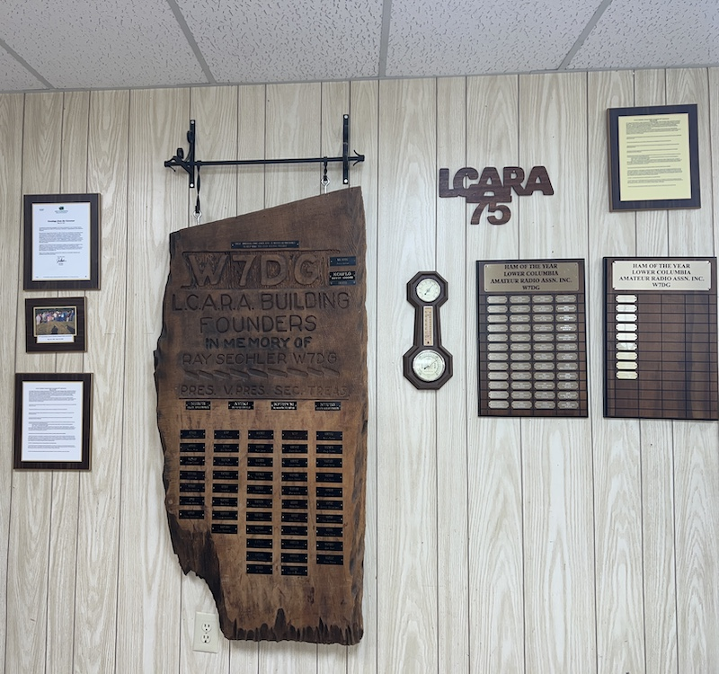
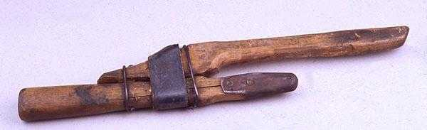
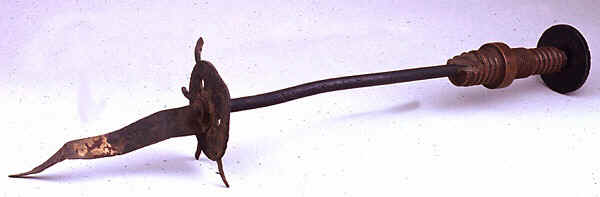
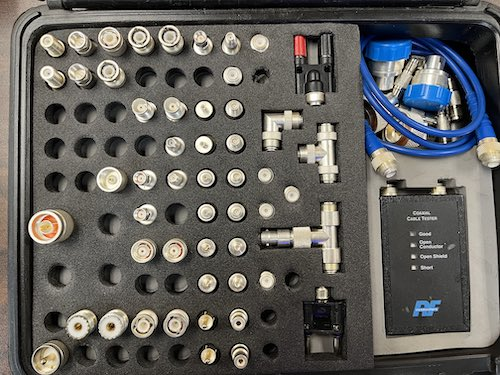
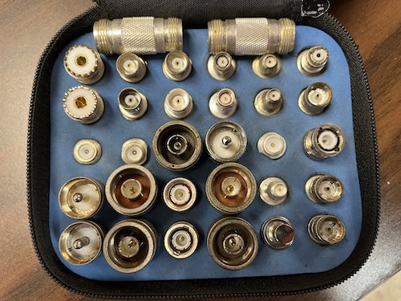

_Maybe you're looking for [next week's](/weekly/2023-04-02) or [last week's](/weekly/2023-03-19) newsletter_?

## Recap 🔁

* 3/22 Wed **LCARA Technical Committee Meeting** _[[Minutes]](https://github.com/w7dg-lcara/static/blob/main/minutes/2023/technical/2023-03-22.md#2023-03-22-lcara-tech-meeting-minutes)_

## Upcoming Events 🗓

* 3/29 Wed 18:30 **LCARA Potluck** at LCARA Clubhouse
  * Please bring a dish to share for 10-12
  * MEMBERS and Family ONLY

## Next Month: April ☔️

* 04/05 Wed 19:00 **Cowlitz ACS Meeting**
* 04/12 Wed 19:00 **LCARA Presentation Night** with Brian KJ7OX
  * “Antenna Modeling” using MMANA-GAL modeling software.
  * We’ll build a dipole in software to see and understand its pattern as well as a
    multi-band short doublet with DX performance in mind.
* 04/19 Wed 19:00 **LCARA Business Meeting** at LCARA Clubhouse

### 04/29 WSDOT Communication Exercise

Next **5th Saturday exercise is April 29**. Cowlitz County ACS is currently
planning where and how to participate in the exercise, which will involve
scripted observations, message passing, and Winlink HF operations across EoCs in
the state.

## Nets ✅

- 03/27 Mon 2000: [Cowlitz County ACS](http://cowlitzradio.org/) Net - Open to all Amateurs
  - [W7DG 147.260 MHz T114 +060](https://www.repeaterbook.com/repeaters/details.php?ID=408&state_id=53)
  - Also, [check in via APRS message](/info/aprsnet/) to [N7DEM-5: CHECKIN Name Location](https://aprs.fi/?c=message&call=N7DEM-5)
- 03/28 Tue 0900: CEMNET Region IV Net - Winlink, V-Tac 12, 224.660 MHz (EOC)
  - Email [kf7hvm@0x26.net](mailto:kf7hvm@0x26.net) to be added to the weekly
    Winlink test
- 03/28 Tue 2000: Rainier GMRS Net - Open to all licensed GMRS operators
  - [WRNM663 462.650 MHz T114.8 +500](https://www.repeaterbook.com/gmrs/details.php?state_id=53&ID=367)
- 04/02 Sun 2000: [W7MSH Mercury Mt. St. Helens](https://www.w7msh.org) ERC Net - Open to all Amateurs
  - 2000 Woodland Checkin [W7DG 147.300 MHz T114 +060](https://www.repeaterbook.com/repeaters/details.php?state_id=53&ID=412)
  - 2015 Roundtable [W7DG 147.260 MHz T114 +060](https://www.repeaterbook.com/repeaters/details.php?ID=408&state_id=53)

## Club Updates

### 75th Anniversary

Look to your left as you enter clubhouse door and you'll find a new wooden sign,
on the Memory Wall, "LCARA 75", to commemorate the club's 75th anniversary this
year.

Thank you to **Sherrie KF7YPD** and **Rick W7RWA** for your gift to LCARA.

### Gratitude 😊

Thanks to **Rick WA7RPM** for diagnosing the recent issues with the furnace. New
parts ⚙️ are on the way, and Brian KJ7OX will install new a new filter, so we can
all breathe a bit easier 🌬️.

Thanks to **Brian KJ7OX** for coordinating the repair 🔧 of the IC-7610 touch screen
with ICOM that was mentioned at the March business meeting (no cost estimate yet 🤞).

Thanks to **Steve K7KO** for adding labels 🏷️ and organizing the physical stations at the clubhouse!

### Repeater Status

* `147.260 MHz`: Repeater occasionally has trouble with input, so the club is in
  the process of identifying and purchasing a replacement commercial-grade
  repeater antenna.
* `147.100 MHz` / `444.900 MHz`: Repeater has persistent issues transmitting.
  **Earl N3EG** measured a -10dB difference in the received signal compared with
  147.260. More investigation is ongoing, but a replacement antenna will likely
  be needed (all three clubhouse repeaters share one tri-band antenna).

## Instruments of Law & Order and Decency

Brian KJ7OX shares [a bit of lore from some earlier days in the Amateur Radio
Service, written by the well known L. B. Cebik, W4RNL (SK)](https://w8an.net/rettysnitch.html)

Have you ever seen a Wouff-Hong or a Rettysnitch?

With these [ancient tools](https://w8an.net/rettysnitch.html), you too can do
your part to bring decency and order to the airwaves.

## [Online Scanner](/2023/03/24/scanner-back-online) Back Up

After a few months offline, I happy to announce that my time-shifting
multi-channel scanner + recorder is now back on the air, in a new and much improved
location. Thanks to Rick WA7RPM for helping me deploy and test the scanner.

### [👂 👉 scanner.kf7hvm.com 📢](https://scanner.kf7hvm.com)

The scanner hears most major VHF repeaters in the area from `146.100 MHz` to `147.500 MHz`
and many simplex frequencies. Now you can catch up on repeater traffic or nets that
were missed or keep an ear on things using a smartphone.

## For Sale 💸

### RFConnectors Adapter Kits

Contact me, KF7HVM, for further information on the connector kits.

#### [RFA-4022](https://rfindustries.com/product/rfa-4022/)

Retail new from $900 - $1300. [[Spec Sheet]](http://www.rfcoaxconnectors.com/pdf/tech-Adapter-RFA-4022.pdf)

Asking $400 or best offer for Partial set shown below.

#### [RFA-4024](https://rfindustries.com/product/rfa-4024/)

Retail new from $175. [[Spec Sheet]](http://rfsearch.rfindustries.com/Assembly/Tools-Unidapt-Installation.pdf)

Asking $100 for complete set.

# Thanks for reading. 

Kindly send any comments, corrections, events, pictures, stories, or content for
this newsletter to [kf7hvm@0x26.net](mailto:kf7hvm@0x26.net).

Consider joining the [LCARA W7DG Facebook Group](https://www.facebook.com/groups/LCARA.W7DG/).
