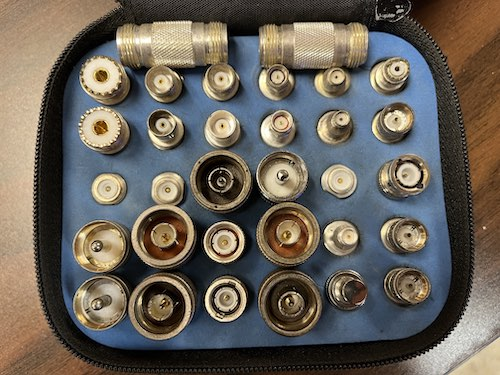

_Maybe you're looking for [next week's](/weekly/2023-04-09) or [last week's](/weekly/2023-03-26) newsletter_?

## Recap 🔁

* 3/29 Wed **LCARA Potluck** at LCARA Clubhouse: Great turnout, thanks for coming and eating.
  * 50/50 raffle brought in a $105 in donations for LCARA!

## Upcoming Events 🗓

* 04/05 Wed 19:00 **Cowlitz ACS Meeting** at LCARA Clubhouse

## Later This Month

* 04/12 Wed 19:00 **LCARA Presentation Night** with Brian KJ7OX
  * “Antenna Modeling” using MMANA-GAL modeling software.
  * We’ll build a dipole in software to see and understand its pattern as well as a
    multi-band short doublet with DX performance in mind.
* 04/19 Wed 19:00 **LCARA Business Meeting** at LCARA Clubhouse

### 04/29 WSDOT Communication Exercise

Next **5th Saturday exercise is April 29**. Cowlitz County ACS is currently
planning where and how to participate in the exercise, which will involve
scripted observations, message passing, and Winlink HF operations across EoCs in
the state.

## Nets ✅

- 04/03 Mon 2000: [Cowlitz County ACS](http://cowlitzradio.org/) Net - Open to all Amateurs
  - [W7DG 147.260 MHz T114 +060](https://www.repeaterbook.com/repeaters/details.php?ID=408&state_id=53)
  - Also, [check in via APRS message](/info/aprsnet/) to [N7DEM-5: CHECKIN Name Location](https://aprs.fi/?c=message&call=N7DEM-5)
- 04/04 Tue 0900: CEMNET Region IV Net - Winlink, V-Tac 12, 224.660 MHz (EOC)
  - Email [kf7hvm@0x26.net](mailto:kf7hvm@0x26.net) to be added to the weekly
    Winlink test
- 04/04 Tue 2000: Rainier GMRS Net - Open to all licensed GMRS operators
  - [WRNM663 462.650 MHz T114.8 +500](https://www.repeaterbook.com/gmrs/details.php?state_id=53&ID=367)
- 04/09 Sun 2000: [W7MSH Mercury Mt. St. Helens](https://www.w7msh.org) ERC Net - Open to all Amateurs
  - 2000 Woodland Checkin [W7DG 147.300 MHz T114 +060](https://www.repeaterbook.com/repeaters/details.php?state_id=53&ID=412)
  - 2015 Roundtable [W7DG 147.260 MHz T114 +060](https://www.repeaterbook.com/repeaters/details.php?ID=408&state_id=53)

## Club Updates

### Gratitude 😊

Thanks to **Matt KD7BBJ** for mowing the lawn last Friday along with **Steve K7KO**.
I heard that the club's mower need additional repairs this year, and Matt was
able to user his own mower to complete the job. **Please donate
time or money towards the groundskeeping effort**.

### Repeater Status

* `147.100 MHz` / `444.900 MHz`: The repeater output measured as expected last
  Friday, which suggests the issue is somewhere in the line or antenna. Further
  investigation is still needed.

### Club History

The year was 1969 and I had just been introduced to an Amateur Radio Club
(LCARA) This club was licensed as **W7NCW** by the Federal government of United
States.

Their meeting place was in North Kelso where they used a room in the Juvenile
Detention building. There was not much in the way of equipment, and a small
tower outside held a tri-band antenna. But the enthusiasm of the men attending
the meeting made up for anything lacking in the amount of equipment.

It was mentioned that a beginner's class was being organized for the following
week so I decided that I would enroll and see what it was all about. (I never
regretted this adventure).

Apparently the club had been formed during the drastic floods in the year 1948.
The Columbia River was at risk of flooding the whole area. The city of **Vanport**,
(just North of Portland) was actually wiped out; Completely destroyed, with a
great loss of life. Longview and Kelso was at great risk of the dykes failing,
but a few Amateur Radio operators put their heads together and communicated with
the authorities as to the condition of the dykes. With their portable radios
they got the word out as to where the dykes were about to fail. Thus the two
towns and many homes were actually saved by their efforts.

Back to the club class that I signed up to take......It was called a Novice, or
beginner's class. This made sense to me because I had absolutely no knowledge of
radio or Morse Code. Morse Code was required at 5 words per minute and some
rudimentary theory was also required. The course was for one evening each week
for six weeks, and there were approximately twenty attendees taking the course.
It turned out to be a great deal of fun, due mainly to the enthusiasm of the two
instructors.

Teaching the theory was Harry Hale, **W7FON**. The Morse Code was taught by Ray
Sechler, **W7DG**.

I passed as a Novice with the call **WN7OMX**.

Among the club members was a local dentist, Richard Palmer, who's call was
**K7RP**. He was friends with the owner of a local radio station which was
situated on Columbia Heights. He was instrumental in gaining permission for the
club to rent an acre of the land upon which the radio station operated. With the
financial assistance of many members we were able to construct the present
building where the club is presently situated.

Each member donated $100 to this effort and also donated lots of hard work. We
poured the cement foundation, purchased all the materials involved, had lots of
fun installing the septic tank, which, incidentally managed to roll down the
slope to the North of the building. It was finally retrieved by a member who had
a Jeep, and is presently in the ground just outside the building on the North
side.

The only part of the building that was not put together by its members was the
actual stonework. This was done by a professional stone mason. We had a member
who was a roofer, who showed us how to install tiles, etc., and we also
installed a 100 foot tower and various beams over the years. These, as you can
see have recently been replaced, as have many radios.

I hope each of you are appreciating the efforts that have gone into the makings
of LCARA and realize what a wonderful club we have.

Over the years we lost our dear friend Ray Sechler. His widow agreed that the
club should apply to the FCC to change the club call from **W7NCW** to **W7DG**
to honor Ray. This was granted, and since that time the club has held the call
**W7DG**.

Look to your left as you enter clubhouse door and you'll find a new wooden sign,
on the Memory Wall, "LCARA 75", to commemorate the club's 75th anniversary this
year.

Sincerely, Stu Farmer, **K7WF**

[[Original]](files/lcara_history_k7wf_1.jpg) [[Page 2]](files/lcara_history_k7wf_2.jpg)

## CW Forever

You must have, at times, thought into the past, 
Where some things go out, while others last, 
What comes to my mind is the Old Morse Code, 
That has weathered the storms from any abode, 

To talk with ones fingers, is surely an art, 
Of any info you care to impart, 
In most conditions the signals get thru, 
While the same about phone is simply not true. 

Those dits and dahs cut through the trash, 
Of nearby noise or lightning's crash, 
To the sensitive ears of the ham receiver, 
Who records this data with ardent fever. 

He knows he's doing something unique, 
(in such poor conditions, that's quite a feat!) 
To roger the message that came off the air, 
These brass pounders sure do have that flair. 

They say Morse ops are a dying breed, 
But don't despair, there's always that need, 
That when conditions get rough for the new automation, 
Be rest assured, there'll be need for your station, 

CW is dying? believe it never, 
This mode will be 'round forever and ever, 
But one thing is sure, what we really need, 
Is to relay our knowledge to the younger breed. 

To carry the torch, long after we're gone, 
To send Morse Code thru the air like a song, 
When at last, Silent Keys pull that final lever, 
We can rest in peace, it's CW forever. 

Jim Hatherley, **WAITBY** 7/4/85  

_Shared by Brian KJ7OX._ [[Original]](files/cw_forever.jpg)

### [👂 👉 scanner.kf7hvm.com 📢](https://scanner.kf7hvm.com)

The scanner hears most major VHF repeaters in the area from `146.100 MHz` to `147.500 MHz`
and many simplex frequencies. Now you can catch up on repeater traffic or nets that
were missed or keep an ear on things using a smartphone.

## For Sale 💸

### RFConnectors Adapter Kits

Contact me, KF7HVM, for further information on the connector kits.

#### [RFA-4022](https://rfindustries.com/product/rfa-4022/)

Retail new from $900 - $1300. [[Spec Sheet]](http://www.rfcoaxconnectors.com/pdf/tech-Adapter-RFA-4022.pdf)

Asking $400 or best offer for Partial set shown below.

#### [RFA-4024](https://rfindustries.com/product/rfa-4024/)

Retail new from $175. [[Spec Sheet]](http://rfsearch.rfindustries.com/Assembly/Tools-Unidapt-Installation.pdf)

Asking $100 for complete set.

# Thanks for reading. 

Kindly send any comments, corrections, events, pictures, stories, or content for
this newsletter to [kf7hvm@0x26.net](mailto:kf7hvm@0x26.net).

Consider joining the [LCARA W7DG Facebook Group](https://www.facebook.com/groups/LCARA.W7DG/).
