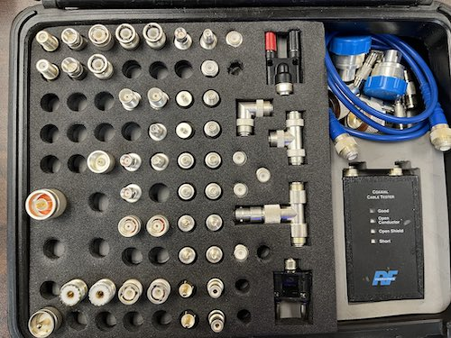

_Maybe you're looking for [last week's newsletter](/weekly/2023-05-21)_?

## Recap 🔁

* 05/24 Wed LCARA Technical Meeting [[Minutes]](https://github.com/w7dg-lcara/static/blob/main/minutes/2023/technical/2023-05-24.md#2023-05-24-lcara-tech-meeting-minutes)
* 05/31 Wed LCARA 5th Wednesday Potluck

## Upcoming Events 🗓

* 06/07 Wed 19:00 **Cowlitz County ACS Meeting** as LCARA Clubhouse
* 06/10 Sat - Sun [**ARRL VHF Contest**](http://www.arrl.org/june-vhf)

### Next Week

* _[TENTATIVE]_ 06/14 Wed 19:00 **LCARA Presentation Night**: WSPR Beacons

### Later This Month

* 06/17 Sat **Tour de Blast Bike Race** [ACS]
* 06/24 Wed 19:00 **LCARA Business Meeting** at LCARA Clubhouse

#### Amateur Radio Field Day - Jun 24

**LCARA** is celebrating its **75th Anniversary** this year with a Field Day
barbeque and operating station at **Willow Grove** park. The event is scheduled
to start at 11:00a with camping available on-site for pre-registered club members.

## Nets ✅

- 06/05 Mon 2000: [Cowlitz County ACS](http://cowlitzradio.org/) Net - Open to all Amateurs
  - [W7DG 147.260 MHz T114 +060](https://www.repeaterbook.com/repeaters/details.php?ID=408&state_id=53)
  - Also, [check in via APRS message](/info/aprsnet/) to [N7DEM-5: CHECKIN Name Location](https://aprs.fi/?c=message&call=N7DEM-5)
- 06/06 Tue 0900: CEMNET Region IV Net - Winlink, V-Tac 12, 224.660 MHz (EOC)
  - Email [kf7hvm@0x26.net](mailto:kf7hvm@0x26.net) to be added to the weekly
    Winlink test
- 06/06 Tue 2000: Rainier GMRS Net - Open to all licensed GMRS operators
  - [WRNM663 462.650 MHz T114.8 +500](https://www.repeaterbook.com/gmrs/details.php?state_id=53&ID=367)
- 06/11 Sun 2000: [W7MSH Mercury Mt. St. Helens](https://www.w7msh.org) ERC Net - Open to all Amateurs
  - 2000 Woodland Checkin [W7DG 147.300 MHz T114 +060](https://www.repeaterbook.com/repeaters/details.php?state_id=53&ID=412)
  - 2015 Roundtable [W7DG 147.260 MHz T114 +060](https://www.repeaterbook.com/repeaters/details.php?ID=408&state_id=53)

## Radio Waves and the Ionosphere

Brian KJ7OX shares [an article on the ARRL web
page](https://www.arrl.org/files/file/Technology/pdf/119962.pdf) written by
G3YWX, which describes the earth's atmospheric layers and how HF radio waves
propagate via these layers.

[https://www.arrl.org/files/file/Technology/pdf/119962.pdf](https://www.arrl.org/files/file/Technology/pdf/119962.pdf)

## For Sale 💸

### RFConnectors Adapter Kits

Contact me, KF7HVM, for further information on the connector kits.

#### [RFA-4022](https://rfindustries.com/product/rfa-4022/)

Retail new from $900 - $1300. [[Spec Sheet]](http://www.rfcoaxconnectors.com/pdf/tech-Adapter-RFA-4022.pdf)

Asking $400 or best offer for Partial set shown below.

#### [RFA-4024](https://rfindustries.com/product/rfa-4024/)

Retail new from $175. [[Spec Sheet]](http://rfsearch.rfindustries.com/Assembly/Tools-Unidapt-Installation.pdf)

Asking $100 for complete set.

# Thanks for reading. 

Kindly send any comments, corrections, events, pictures, stories, or content for
this newsletter to [kf7hvm@0x26.net](mailto:kf7hvm@0x26.net).

Consider joining the [LCARA W7DG Facebook Group](https://www.facebook.com/groups/LCARA.W7DG/).
